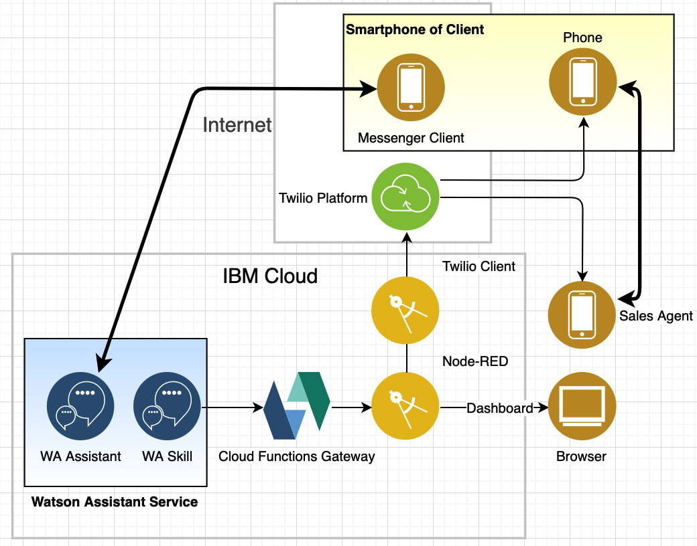

# Chatbot with Handover to a Call with a Sales Agent

A chatbot using the Watson Assistant services which continues the dialog via phone should the client prefer to talk to a sales agent.

Initially the client chats via Messenger with a chatbot. If she initiates a handover to a sales agent
- Twilio calls the phones of the client and then the phone of a sales agent,
- the two start to talk,
- the status of the preceding conversation can be displayed on the Node-RED dashboard to the agent.

