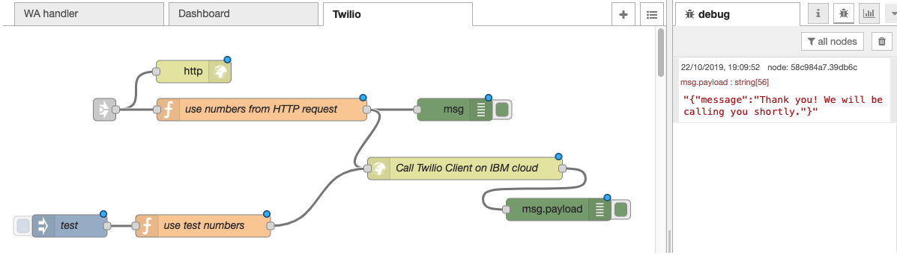

Remark: This repo is under contruction

# Handover from chatbot to phone call

A chatbot using the Watson Assistant services which continues the dialog via phone should the client prefer to talk to an agent.

## Problem statement
While chatbots are widely used by companies to get information from clients, sometimes users stop the conversation for various reason (duration of the dialog, unclear question). In those cases a handover to an agent helps continue the dialog.

## Architecture
The *Watson Assistant service* is the basis of the chatbot: the Skill controls the dialog, the Assistant is used as an interface to Messenger.
The solution leverages *Node-RED* as a prototyping platform, controlling the application and the web frontend.


The Watson Assistant service can do programmatic calls to integrate with backend systems using *IBM Cloud Functions*. So I created a small [gateway](https://github.com/gitjps/watsonassistant-nodered-gateway) to call Node-RED from the Watson Assistant service.

*Twilio* is a developer platform for communications to add capabilities like voice, video, and messaging to applications. I used the standard [clicktocall Node.js repo](https://github.com/TwilioDevEd/clicktocall-node) and integrated it into the solution.

## Assumptions & Prereqs
- Some experiences with IBM Cloud, Node-RED is needed
- [Twilio account](https://www.twilio.com/) and paid virtual phone number
- Free [nkrok](https://ngrok.com/) account, if you want to run and test the Twilio client locally (nice to have, but not necessary)
- [IBM Cloud](https://www.ibm.com/cloud) account (consumption should be within the free lite plan) for a permanent deployment of the Twilio client


## Use Case Description
Initially the client chats via Messenger with the Watson Assistant chatbot. 

If she initiates a handover to an agent:
- Twilio calls the phones of the client and the phone of an agent subequently,
- the two start to talk,
- the status of the preceding chatbot conversation can be displayed on the Node-RED dashboard to the agent (not implemented yet).

## Installation Instructions
The following steps provide an overall overview what needs to be done. Some understanding of app development and [IBM Cloud](https://cloud.ibm.com/registration) are required to follow along.

### Twilio

#### Preparation

- Get a [Twilio account](https://www.twilio.com/voice), note down your account SID
- [Verify](https://www.twilio.com/console/phone-numbers/verified) two phone numbers that you want to call later. You could, for example use your landline (client) and cell number (agent)
- Get an [authentication token](https://www.twilio.com/console/project/settings)
- Buy a [virtual phone number](https://www.twilio.com/console/phone-numbers/search), if you don't have one already

#### Local Twilio Client

- Clone [this repository](https://github.com/gitjps/chatbot_phone_handover) onto your laptop
- Go to the Twilio client folder and install the dependencies

```
cd Twilio client click-to-call
npm install
```

See [Click To Call with Node.js and Express](https://www.twilio.com/docs/voice/tutorials/click-to-call-node-express) for documentation
- Start the client and the tunnel, that exposes the local REST APIs on the web

```
node app.js
./ngrok http 3000
```

- Perform a test on https://your_address.ngrok.io:3000 calling the two numbers above

#### Twilio client on IBM Cloud

- Login into IBM Cloud from command line, use the organization/space you would like to push the Node.js to 
- Change the app name in [manifest file manifest.yml](https://github.com/gitjps/chatbot_phone_handover/blob/master/Twilio%20client%20click-to-call/manifest.yml) and push the local app to the IBM Cloud (cf push)
- Perform the test again, use the route to the app on IBM Cloud

### Node-RED on IBM Cloud

- [Create a Node-RED instance](https://cloud.ibm.com/catalog/starters/node-red-starter) and import [node-red.json](https://cloud.ibm.com/catalog/starters/node-red-starter)
- Go to the Twilio flow

- Open the function node *use test numbers* and modify the numbers and the URL of the Twilio client
- Open the *Call Twilio Client on IBM Cloud* node and modify the URL
- Deploy the changes
- Click on the *test* injection node, you should see a message from Twilio in the debug pane

### IBM Cloud Functions

- [Create an IBM Cloud Functions Node.js action](https://cloud.ibm.com/functions/actions) using [gateway.js](https://github.com/gitjps/chatbot_phone_handover/blob/master/gateway.js), also [Getting Started](https://cloud.ibm.com/docs/openwhisk?topic=cloud-functions-getting-started&locale=de)
- The connection to Node-RED can be tested by entering parameters (*Change Input* button) and starting the action (*Invoke* button)

```
{
        "query_params": "?request=start_call&phoneNumber=%2B491725555555&vin=ABC&salesNumber=%2B493615555555",
        "target_route": "/wahandler",
        "target_hostname": "http://yournodereddomain.mybluemix.net"
}
```
- Go to the Endpoints section and note the API key 

### Watson Assistant
- Create a [Watson Assistant Service](https://cloud.ibm.com/catalog/services/watson-assistant), see also the [Getting Started Guide](https://cloud.ibm.com/docs/services/assistant?topic=assistant-getting-started)
- [Create a  new skill](https://cloud.ibm.com/docs/services/assistant?topic=assistant-skill-dialog-add&locale=en) by importing JSON skill file [https://github.com/gitjps/chatbot_phone_handover/blob/master/skill-claim.json](skill-claim.json)
- Go to the dialog and adapt some nodes 
-- *yes, call agent* (phone numbers)
-- *welcome* (API key)
-- *current time*
-- *claim damage* (API key)
- **Test** Use the *Try Out* button
- [Create an assistant](https://cloud.ibm.com/docs/services/assistant?topic=assistant-assistant-add&locale=en) for web browser and Messenger


